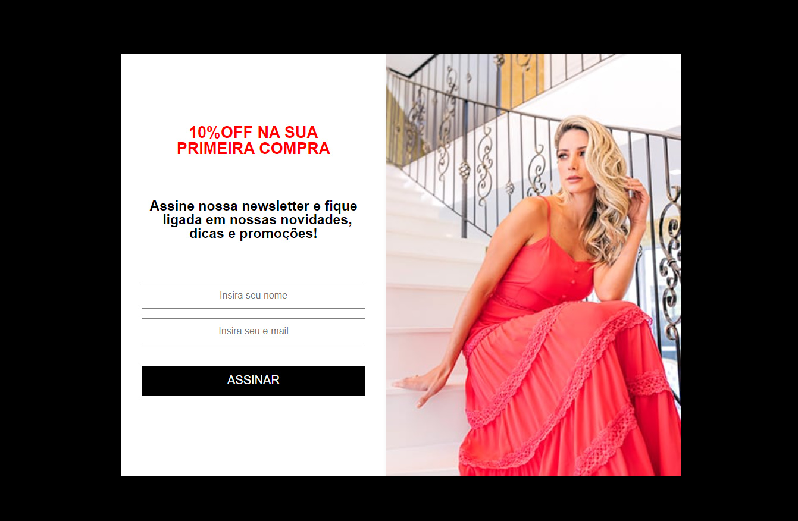
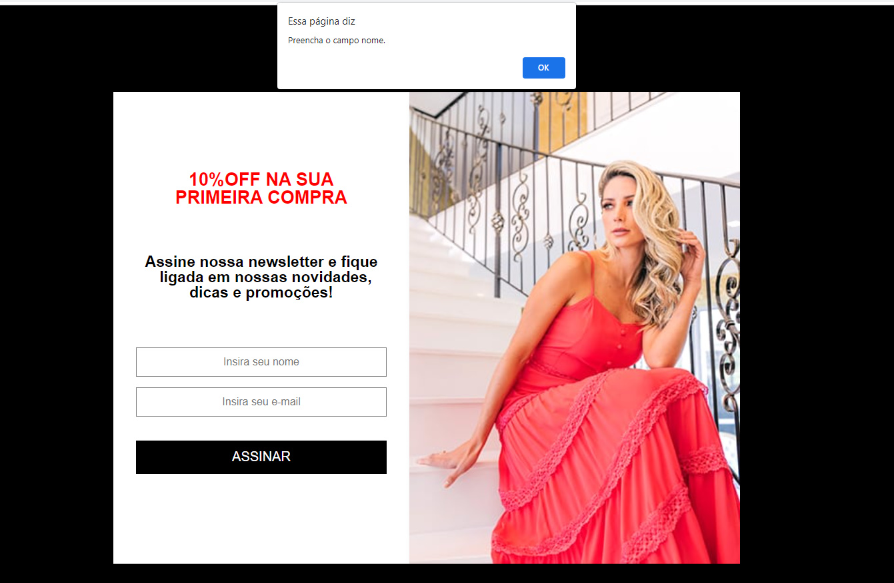
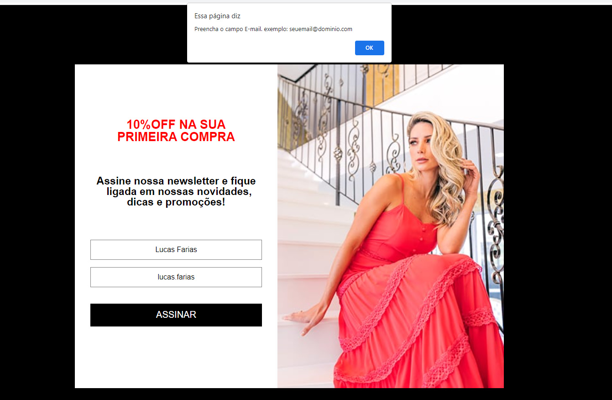
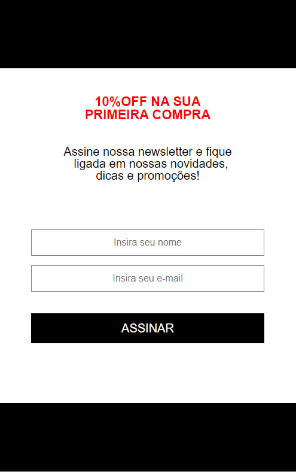

# braavo-teste

Página HTML exemplificando uma newsletter.

# Utilização 
    Para utilizar o projeto, dar clone neste repositório e abrir o navegador de sua escolha.

# Tecnologias envolvidas 
    O projeto foi desenvolvido com  HTML5, CSS3, SASS, JavaScript.

# O que foi feito
    Foi desenvolvido o layout de uma newsletter, que tem como finalidade cadastrar um usuário para receber notificações, onde foram realizadas validações atráves do javaScript e HTML para que o usuário preencha corretamente todos os campos. Validações como: O usuário deve preencher todos os campos antes de clicar no botão assinar, deve preencher o campo nome sem números e com no máximo 50 caracteres, no campo e-mail o usuário precisa digitar um e-mail valído da forma correta, se algum campo for preenchido de maneira equivocada o usuário é prontamente notificado atráves de um alerta do navegador, onde esse alerta exemplifica como deve ser digitado o campo em questão para que ele consiga realizar o cadastro na newsletter.
 

# Imagens de exemplo
 
 Layout de exemplo da newsletter.

 Ao clicar no botão assinar sem preencher os campos aparece um alerta
 para que os mesmos sejam preenchidos.

 

 Usuário sendo notificado pois não preencheu corretamente o e-mail.

 

Usuário não deve por números do campo nome.

Todos os campos devem ser preenchidos.

O e-mail deve ser preenchido conforme o exemplo do alerta.
exemplo: "seuemail@dominio.com".

Layout responsivo, exemplo da newsletter. 

